# 🚗 Health Insurance Cross-Sell Prediction — Vehicle Insurance Propensity Scoring

[](https://github.com/narendrakalam2001/health-insurance-cross-sell-mlops/actions)
[](https://python.org)
[](https://scikit-learn.org)
[](https://fastapi.tiangolo.com)
[](https://streamlit.io)
[](https://scikit-learn.org/stable/modules/ensemble.html)
[](https://docker.com)
[](https://mlflow.org)
[](tests/)
[](LICENSE)

> **Domain:** Insurance / BFSI / Fintech
> **Problem:** Binary Classification — predict which existing health insurance customers will buy vehicle insurance
> **Dataset:** [Health Insurance Cross Sell Prediction — 381,109 customers · 11 features](https://www.kaggle.com/datasets/anmolkumar/health-insurance-cross-sell-prediction)
> **Industry Context:** Bajaj Allianz · HDFC Ergo · ICICI Lombard · Policybazaar — cross-sell propensity models cut cold-calling cost by **60–70%** while lifting conversion rates

---

## 💡 Why This Project Matters

An insurance call centre cannot phone 380,000 policyholders. Cold-calling the full base costs money, burns agent hours, and annoys customers who were never going to convert. This system simulates a production-grade BFSI cross-sell targeting pipeline:

- An **ExtraTrees classifier** scores every existing health-insurance customer on their propensity to buy vehicle insurance
- **Hard business rules run BEFORE the ML model** — a customer who already holds vehicle insurance (`previously_insured=1`) or has no driving licence is dropped from the call list outright, no model call needed. This mirrors how real cross-sell desks work: deterministic disqualifiers first, probability second
- The **3-Tier Lead Engine** converts a calibrated probability into an actionable queue — `HOT_LEAD` (call today), `WARM_LEAD` (low-cost email/SMS nurture), `COLD_LEAD` (skip)
- **Isotonic calibration** on a dedicated holdout set makes the probability trustworthy enough to set a business threshold on — Brier score improves **0.1697 → 0.0891**
- Every model promotion goes through a **3-gate Champion-Challenger** check — no model reaches production without demonstrably better F1, adequate ROC-AUC, and controlled generalization gap

On the held-out test set this cuts the call list from 76,168 customers to 24,546 — **67.8% of calls eliminated** while still capturing 7,450 of the 9,337 actual buyers.

---

## 🏆 Champion Model Results

Real numbers from the full training run on all 380,840 rows (`n_test = 76,168`):

| Metric | Score |
|---|---|
| **Champion Model** | `ExtraTrees` |
| **F1 Score** | `0.4397` |
| **ROC-AUC** | `0.8404` |
| **PR-AUC** | `0.3231` |
| **KS Statistic** | `0.5807` |
| **Precision** | `0.3035` |
| **Recall** | `0.7979` |
| **Brier (uncalibrated)** | `0.1697` |
| **Brier (after isotonic calibration)** | `0.0891` |
| **Train / Test Accuracy** | `0.7006 / 0.6965` |
| **Generalization Gap** | `0.0041` |
| **CV Mean F1 (std)** | `0.4307 (±0.0014)` |
| **Repeated CV F1 (5×5, std)** | `0.4300 (±0.0020)` |
| **Active threshold (calibrated)** | `0.2192` |
| **Cold calls eliminated** | **`67.8%`** |

> **Why is F1 ~0.44 and not 0.95?** Cross-sell propensity is a genuinely hard, weakly-separable problem — unlike credit default where income and history separate classes sharply. Published solutions on this dataset cluster around **ROC-AUC 0.85–0.88**, so 0.8404 sits in the expected band. The business value here comes from *ranking* customers correctly (KS = 0.58, high recall at 0.80), not from perfect classification. A model that recalls 80% of buyers while dropping 68% of the call list is exactly what a cross-sell desk wants.

---

## 🔗 Live Links

| Service | URL |
|---|---|
| 🚀 **FastAPI (Swagger UI)** | [https://health-insurance-crosssell-mlops.onrender.com/docs](https://health-insurance-crosssell-mlops.onrender.com/docs) |
| 📊 **Monitoring Dashboard** | [https://health-insurance-crosssell-mlops.streamlit.app](https://health-insurance-crosssell-mlops.streamlit.app) |
| 📓 **EDA Notebook** | [notebooks/health_insurance_cross_sell_eda.ipynb](notebooks/health_insurance_cross_sell_eda.ipynb) |

> ⚠️ Render free tier: first request may take 30–60 seconds (cold start).

---

## 🏗️ System Architecture

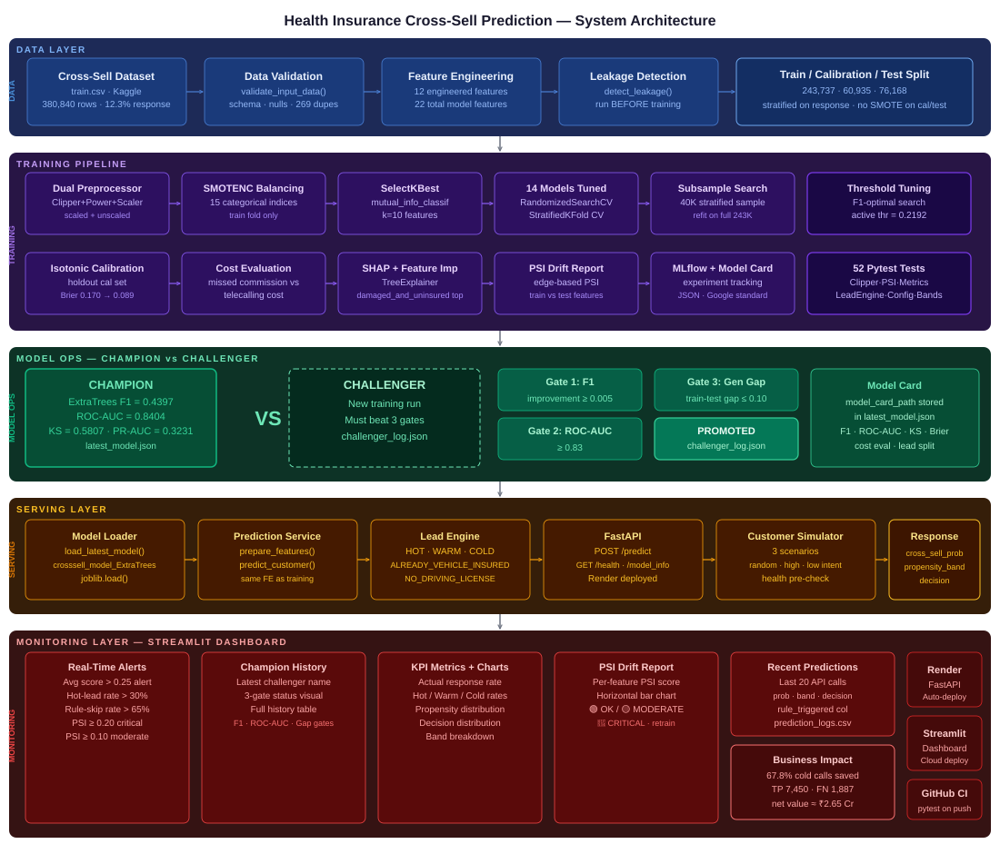

```
╔══════════════════════════════════════════════════════════════════════════════════╗
║      HEALTH INSURANCE CROSS-SELL — 5-LAYER PRODUCTION SYSTEM                     ║
╠══════════════════════════════════════════════════════════════════════════════════╣
║                                                                                  ║
║  ┌─────────────────────────────── DATA LAYER ──────────────────────────────┐     ║
║  │  train.csv → Validate + Dedupe → Feature Engineering → Leakage Check    │     ║
║  │  380,840 rows · 12.3% response · 269 dupes dropped · 22 model features  │     ║
║  │  Stratified split: train 243,737 · cal 60,935 · test 76,168             │     ║
║  └───────────────────────────────────┬─────────────────────────────────────┘     ║
║                                      ▼                                           ║
║  ┌─────────────────────────── TRAINING PIPELINE ───────────────────────────┐     ║
║  │                                                                         │     ║
║  │  ┌──────────────────┐    ┌───────────────┐    ┌──────────────────────┐  │     ║
║  │  │ Dual Preprocessor│    │  14 Models    │    │  Evaluation          │  │     ║
║  │  │ Clipper(IQR)     │───▶│  LR·KNN·SGD   │───▶│  F1 · ROC-AUC · KS  │  │     ║
║  │  │ Power+Scaler     │    │  RF·ET·GB·XGB │    │  Isotonic calibration│  │     ║
║  │  │ scaled+unscaled  │    │  LGBM·CatBoost│    │  SHAP · PSI · MLflow │  │     ║
║  │  └──────────────────┘    └───────────────┘    └──────────────────────┘  │     ║
║  │                                                                         │     ║
║  │  SMOTENC (15 categorical indices) · SelectKBest mutual_info · k=10      │     ║
║  │  RandomizedSearchCV on 40K stratified subsample → refit on full 243K    │     ║
║  │                                                                         │     ║
║  │  CHAMPION → ExtraTrees  F1=0.4397  ROC-AUC=0.8404  KS=0.5807            │     ║
║  └───────────────────────────────────┬─────────────────────────────────────┘     ║
║                                      ▼                                           ║
║  ┌──────────────────────── CHAMPION-CHALLENGER ────────────────────────────┐     ║
║  │                                                                         │     ║
║  │  Gate 1: F1 improvement       ≥ 0.005  →  ✅ PASS / ❌ FAIL            │     ║
║  │  Gate 2: challenger ROC-AUC   ≥ 0.83   →  ✅ PASS / ❌ FAIL            │     ║
║  │  Gate 3: train-test gap       ≤ 0.10   →  ✅ PASS / ❌ FAIL            │     ║
║  │                                                                         │     ║
║  │  ALL gates pass → PROMOTED (latest_model.json updated)                  │     ║
║  │  ANY gate fails → REJECTED (champion retained, result logged)           │     ║
║  └───────────────────────────────────┬─────────────────────────────────────┘     ║
║                                      ▼                                           ║
║  ┌──────────────────────────── SERVING LAYER ──────────────────────────────┐     ║
║  │                                                                         │     ║
║  │  Model Loader → Prediction Service → Lead Engine → FastAPI              │     ║
║  │                                                                         │     ║
║  │  POST /predict     → customer JSON  (→ HOT / WARM / COLD lead)          │     ║
║  │  GET  /health      → API health     (→ {status, model_loaded})          │     ║
║  │  GET  /model_info  → champion model card (→ metrics + thresholds)       │     ║
║  │                                                                         │     ║
║  │  Lead Engine:  hard rules FIRST → calibrated probability → tier         │     ║
║  │    → previously_insured=1     → COLD_LEAD (ALREADY_VEHICLE_INSURED)     │     ║
║  │    → driving_license=0        → COLD_LEAD (NO_DRIVING_LICENSE)          │     ║
║  │    → p ≥ thr                  → HOT_LEAD   (call today)                 │     ║
║  │    → p ≥ thr × 0.6            → WARM_LEAD  (nurture campaign)           │     ║
║  │    → else                     → COLD_LEAD  (skip)                       │     ║
║  └───────────────────────────────────┬─────────────────────────────────────┘     ║
║                                      ▼                                           ║
║  ┌─────────────────── MONITORING LAYER — STREAMLIT DASHBOARD ──────────────┐     ║
║  │                                                                         │     ║
║  │  Section 1: Real-Time Alerts    → avg score · hot-lead rate · PSI       │     ║
║  │  Section 2: Champion-Challenger → decision · 3-gate status · history    │     ║
║  │  Section 3: KPIs + Charts       → lead split · propensity distribution  │     ║
║  │  Section 4: PSI Drift           → per-feature PSI max=0.0002 (STABLE)   │     ║
║  │  Section 5: Recent Predictions  → audit log · band · rule triggered     │     ║
║  │  Sidebar:   Live Scoring        → enter customer → instant lead tier    │     ║
║  │                                                                         │     ║
║  │  Simulator: 3 scenarios (random · high_intent · low_intent) → /predict  │     ║
║  └─────────────────────────────────────────────────────────────────────────┘     ║
╚══════════════════════════════════════════════════════════════════════════════════╝
```

---

## 📸 Dashboard Screenshots

### 🖥️ Full Dashboard UI

Real-time cross-sell scoring dashboard — Live sidebar scoring · Champion-Challenger system · KPI cards · PSI drift · prediction audit log.

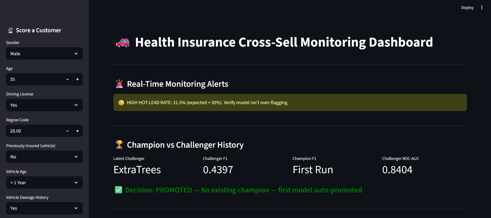

---

### 📊 Model Performance KPIs

Actual response rate vs predicted lead split — HOT / WARM / COLD rates · propensity score distribution with band boundaries.

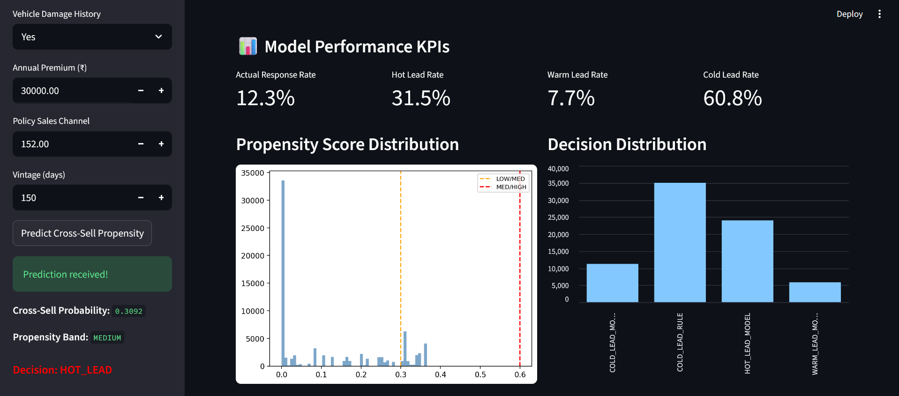

---

### 🎯 Propensity Band Breakdown

Distribution of customers across LOW (0–0.30) · MEDIUM (0.30–0.60) · HIGH (0.60–1.0) propensity bands.

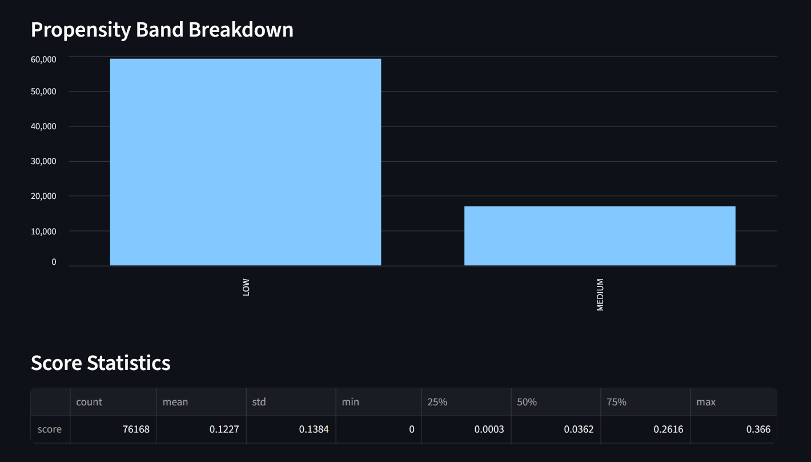

---

### 📈 Feature Drift Report (PSI)

Per-feature Population Stability Index with colour-coded status — 🟢 OK · 🟡 MODERATE · 🔴 CRITICAL.

.png>)

---

### 📉 Feature PSI Drift Scores

Horizontal PSI bar chart with moderate (0.10) and critical (0.20) threshold lines — all features well within stable range.

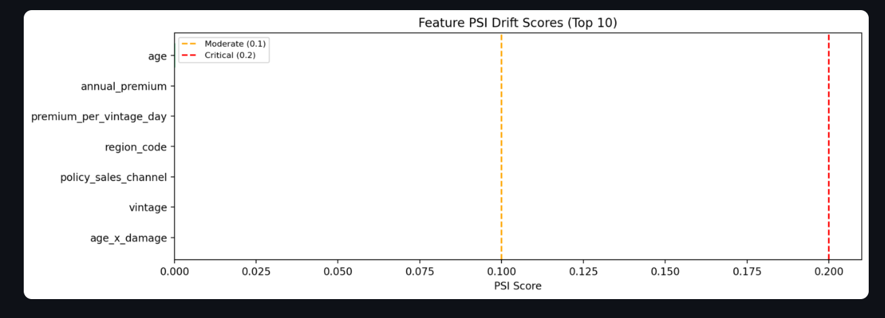

---

### 📋 Recent Predictions Log

Last 20 API predictions — probability · propensity band · decision · rule triggered.

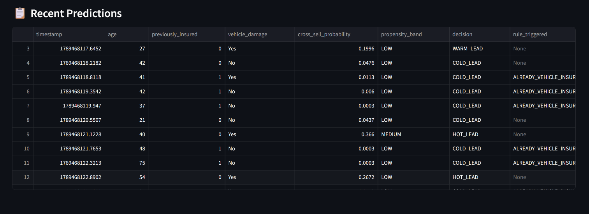

---

## 📊 Training Reports

| Confusion Matrix | ROC & PR Curves |
|---|---|
| 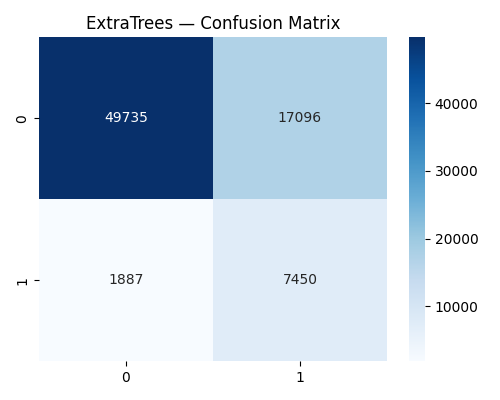 | 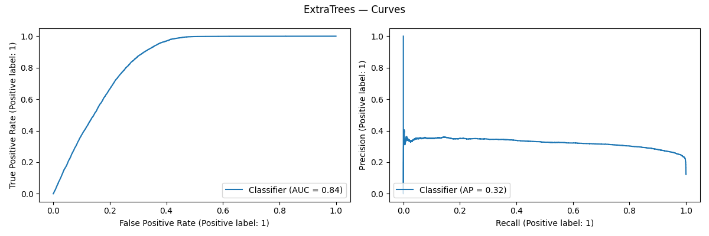 |

| Champion-Challenger | Test Coverage |
|---|---|
| 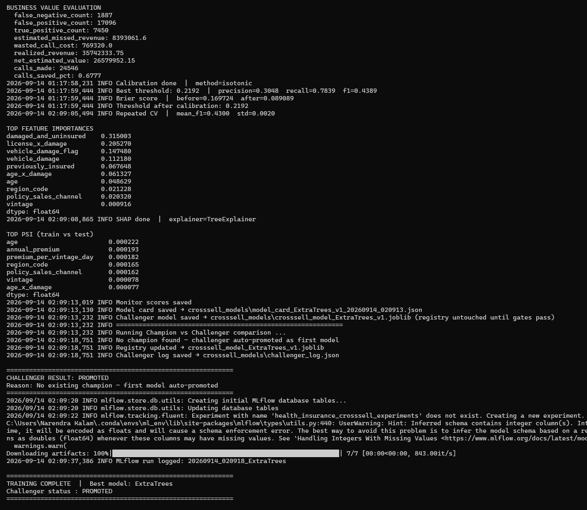 | 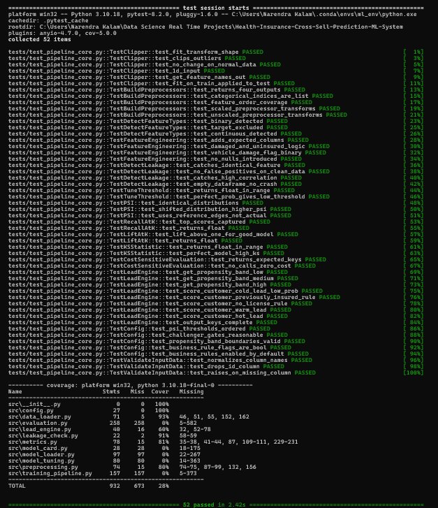 |

| Simulation Run | Training & Evaluation Summary |
|---|---|
| 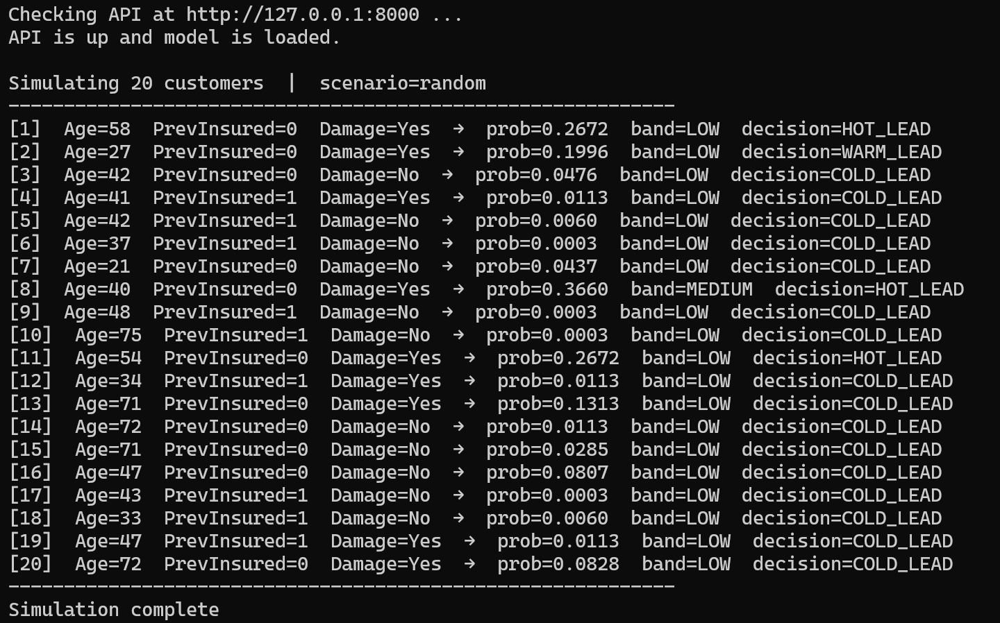 | 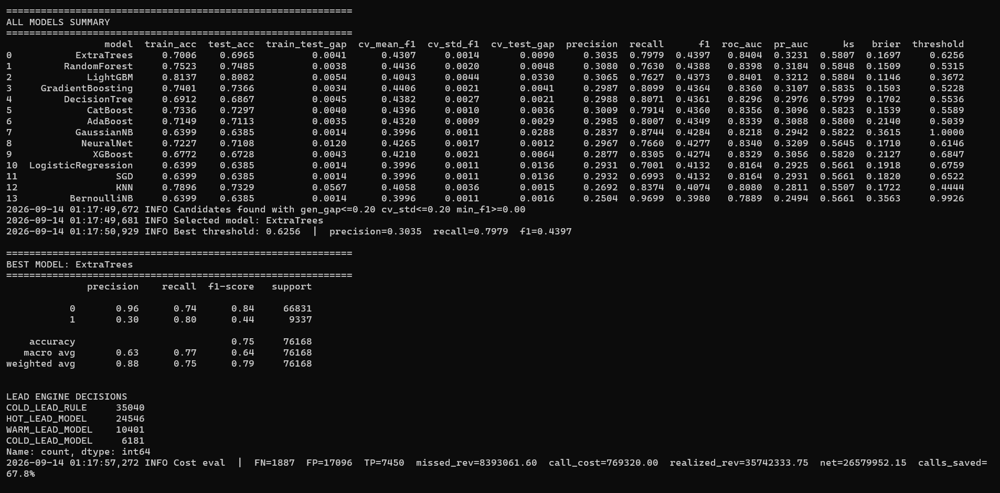 |

---

## 🎬 System Demo

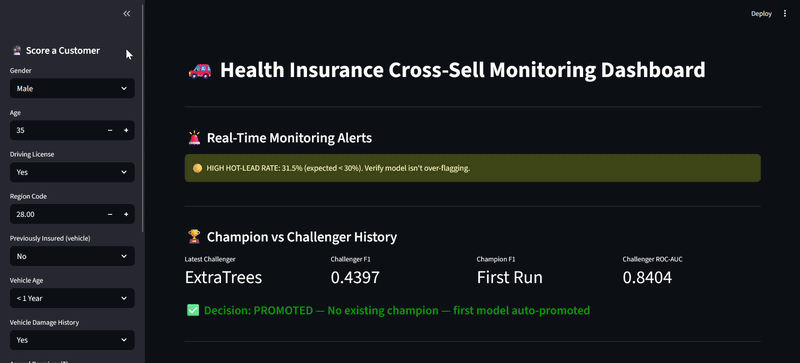

---

## 📁 Project Structure

```
health-insurance-crosssell-mlops/
│
├── src/                                    # Core ML system
│   ├── config.py                           # All constants — gates, PSI thresholds, propensity bands, cost params
│   ├── data_loader.py                      # Validation · 12 engineered features · feature type detection
│   ├── preprocessing.py                    # Clipper (IQR) · dual ColumnTransformer (scaled + unscaled)
│   ├── leakage_check.py                    # Pre-training correlation + duplicate-feature leakage guard
│   ├── metrics.py                          # PSI (edge-based) · KS · recall@K · lift@K · cost-sensitive eval
│   ├── model_tuning.py                     # 13 model grids + MLP · subsample search → full refit
│   ├── lead_engine.py                      # 3-tier lead engine — hard rules + propensity bands
│   ├── evaluation.py                       # Model eval · isotonic calibration · SHAP · MLflow logging
│   ├── model_card.py                       # Google Model Card standard JSON builder
│   ├── model_loader.py                     # Champion-Challenger 3-gate system + registry
│   └── training_pipeline.py                # End-to-end 24-step training orchestration
│
├── serving/
│   └── crosssell_api.py                    # FastAPI: /predict · /health · /model_info
│
├── services/
│   └── prediction_service.py               # Customer JSON → feature engineering → lead decision
│
├── monitoring/
│   └── crosssell_dashboard.py              # Streamlit: 5-section monitoring dashboard
│
├── simulation/
│   └── customer_simulator.py               # 3-scenario customer generator (random · high_intent · low_intent)
│
├── tests/
│   └── test_pipeline_core.py               # 52 pytest unit tests — all passing
│
├── scripts/
│   ├── train_model.py                      # python scripts/train_model.py
│   ├── run_api.py                          # python scripts/run_api.py
│   ├── run_dashboard.py                    # python scripts/run_dashboard.py
│   ├── run_simulation.py                   # python scripts/run_simulation.py
│   └── generate_synthetic_data.py          # Schema-matched sample dataset generator
│
├── notebooks/
│   ├── health_insurance_cross_sell_eda.ipynb   # Professional EDA — 22 steps
│   └── health_insurance_cross_sell_eda.html    # Rendered HTML (viewable without Jupyter)
│
├── data/
│   ├── sample_health_insurance_cross_sell_dataset.csv   # Representative sample for quick testing
│   └── sample_dataset_info.txt                          # Schema + how to get the full Kaggle dataset
│
├── crosssell_models/                       # Model artifacts
│   ├── latest_model.json                   # Champion model registry (name + threshold + card path)
│   ├── challenger_log.json                 # Full Champion-Challenger comparison history
│   ├── model_card_ExtraTrees_v1_*.json     # Google Model Card JSON
│   ├── model_experiment_results.csv        # All 14 models — F1 · ROC-AUC · KS · Brier · gap
│   ├── feature_drift_report.csv            # PSI drift per feature
│   └── monitor_scores.csv                  # Test-set scores + decisions for the dashboard
│
├── docs/
│   ├── architecture/
│   │   └── system_architecture.svg                 # 5-layer system architecture diagram
│   ├── plots/
│   │   ├── confusion_matrix.png                    # Champion confusion matrix
│   │   └── roc_pr_curves.png                       # ROC + Precision-Recall curves
│   ├── screenshots/
│   │   ├── dashboard_full_ui.png                   # Full Streamlit dashboard UI
│   │   ├── model_performance_kpis.png              # KPI cards + score distribution
│   │   ├── propensity_band_breakdown.png           # LOW / MEDIUM / HIGH band split
│   │   ├── feature_drift_report(psi).png           # PSI status table
│   │   ├── feature_psi_drift_scores.png            # PSI horizontal bar chart
│   │   └── recent_predictions.png                  # Recent predictions audit log
│   ├── reports/
│   │   ├── challenger_evaluation.png               # Champion-Challenger gate results
│   │   ├── simulation.png                          # Simulation run terminal output
│   │   ├── test_coverage.png                       # pytest 52/52 coverage report
│   │   └── training_model_summary.png              # Training summary
│   └── gifs/
│       └── system_demo.gif                         # End-to-end system demo
│
├── logs/
│   └── prediction_logs.csv                # API prediction audit log (auto-generated)
│
├── Dockerfile                             # FastAPI production image (multi-stage)
├── Dockerfile.dashboard                   # Streamlit dashboard container
├── docker-compose.yml                     # API + Dashboard (ports 8000 + 8501)
├── .github/workflows/ci.yml               # GitHub Actions — pytest on every push
├── .gitignore
├── .dockerignore
├── LICENSE                                # MIT License
├── README.md                              # This file
├── render.yaml                            # Render.com deployment config
├── requirements.txt                       # All dependencies
├── requirements_api.txt                   # API-only deps (lean Render build)
├── requirements_dashboard.txt             # Dashboard-only deps (Streamlit Cloud)
└── runtime.txt                            # Python 3.10.13
```

---

## 🚀 Quickstart

### 1. Clone & Install

```bash
git clone https://github.com/narendrakalam2001/health-insurance-crosssell-mlops.git
cd health-insurance-crosssell-mlops
pip install -r requirements.txt
```

### 2. Get the Dataset

Download [Health Insurance Cross Sell Prediction](https://www.kaggle.com/datasets/anmolkumar/health-insurance-cross-sell-prediction) → place `train.csv` anywhere, then point the pipeline at it:

```bash
# Windows PowerShell
$env:CROSSSELL_DATA_PATH="D:\path\to\train.csv"

# Linux / Mac
export CROSSSELL_DATA_PATH="/path/to/train.csv"
```

```
data/
├── sample_health_insurance_cross_sell_dataset.csv
└── sample_dataset_info.txt

A representative sample dataset is provided for quick testing — schema-identical
to the Kaggle file, so the pipeline runs end-to-end without the full download.
```

> `validate_input_data()` normalizes column names (`Gender` → `gender`, `Annual_Premium` → `annual_premium`), so the raw Kaggle headers work with no code changes.

### 3. Train Model

```bash
python scripts/train_model.py
```

Expected output:
```
INFO  Data validation passed  | shape=(380840, 11) | response_rate=0.123
INFO  Feature engineering done | total columns=23
INFO  Split | train_fit=243737  cal=60935  test=76168
INFO  Leakage check passed — no obvious leakage detected
INFO  Large dataset (243737 rows) — searching hyperparameters on a 40000-row
      stratified subsample, then refitting best params on the full data
INFO  Selected model: ExtraTrees
INFO  Calibration done | method=isotonic
INFO  Brier score | before=0.169724  after=0.089089
INFO  SHAP done | explainer=TreeExplainer
INFO  No champion found — challenger auto-promoted as first model
TRAINING COMPLETE  |  Best model: ExtraTrees
```

> ⏱️ **Runtime:** ~3 hours on a standard laptop CPU for the full 380K-row run across all 14 models.

### 4. Start API

```bash
python scripts/run_api.py
# API:  http://localhost:8000
# Docs: http://localhost:8000/docs
```

> Auto-reload is off by default — the champion model is large, so a mid-run reload would stall in-flight requests. Use `python scripts/run_api.py --reload` only when editing API source.

### 5. Start Dashboard

```bash
python scripts/run_dashboard.py
# Dashboard: http://localhost:8501
```

### 6. Run Simulation

Start the API in one terminal, then in a second terminal:

```bash
python scripts/run_simulation.py
```

The simulator health-checks the API first, then streams synthetic customers through `/predict`.

### 7. Run Tests

```bash
pytest tests/ -v --cov=src --cov-report=term-missing
# 52 collected · 52 passed · 0 failed (2.94s)
```

---

## 🐳 Docker

```bash
# Start everything
docker compose up --build

# API only
docker compose up api

# Dashboard only
docker compose up dashboard

# Stop
docker compose down
```

| Service | URL |
|---|---|
| FastAPI + Swagger | `http://localhost:8000/docs` |
| Streamlit Dashboard | `http://localhost:8501` |

> Train the model locally first so `crosssell_models/` contains the artifacts before starting Docker.

---

## 🌐 API Reference

### POST /predict — Score a Single Customer

```bash
curl -X POST "http://localhost:8000/predict" \
  -H "Content-Type: application/json" \
  -d '{
    "gender": "Male",
    "age": 35,
    "driving_license": 1,
    "region_code": 28.0,
    "previously_insured": 0,
    "vehicle_age": "1-2 Year",
    "vehicle_damage": "Yes",
    "annual_premium": 32000.0,
    "policy_sales_channel": 152.0,
    "vintage": 150
  }'
```

**Response — high-propensity customer:**
```json
{
  "cross_sell_probability": 0.7277,
  "propensity_band": "HIGH",
  "decision": "HOT_LEAD",
  "rule_triggered": null,
  "latency_seconds": 0.0421
}
```

**Response — hard business rule fired:**
```json
{
  "cross_sell_probability": 0.0542,
  "propensity_band": "LOW",
  "decision": "COLD_LEAD",
  "rule_triggered": "ALREADY_VEHICLE_INSURED",
  "latency_seconds": 0.0389
}
```

### GET /health

```json
{"status": "running", "model_loaded": true}
```

### GET /model_info

Returns the champion model registry — model file, active threshold, and model card path.

---

## 📊 All 14 Models — Comparison Table

Real test-set results from the full training run (`n = 76,168`):

| Model | Train Acc | Test Acc | Gap | CV F1 (std) | Precision | Recall | **F1** | ROC-AUC | PR-AUC | KS | Brier | Threshold |
|---|---|---|---|---|---|---|---|---|---|---|---|---|
| **ExtraTrees** ⭐ | 0.7006 | 0.6965 | 0.0041 | 0.4307 (0.0014) | 0.3035 | 0.7979 | **0.4397** | 0.8404 | 0.3231 | 0.5807 | 0.1697 | 0.6256 |
| RandomForest | 0.7523 | 0.7485 | 0.0038 | 0.4436 (0.0020) | 0.3080 | 0.7630 | 0.4388 | 0.8398 | 0.3184 | 0.5848 | 0.1509 | 0.5315 |
| LightGBM | 0.8137 | 0.8082 | 0.0054 | 0.4043 (0.0044) | 0.3065 | 0.7627 | 0.4373 | 0.8401 | 0.3212 | 0.5884 | 0.1146 | 0.3672 |
| GradientBoosting | 0.7401 | 0.7366 | 0.0034 | 0.4406 (0.0021) | 0.2987 | 0.8099 | 0.4364 | 0.8360 | 0.3107 | 0.5835 | 0.1503 | 0.5228 |
| DecisionTree | 0.6912 | 0.6867 | 0.0045 | 0.4382 (0.0027) | 0.2988 | 0.8071 | 0.4361 | 0.8296 | 0.2976 | 0.5799 | 0.1702 | 0.5536 |
| CatBoost | 0.7336 | 0.7297 | 0.0040 | 0.4396 (0.0010) | 0.3009 | 0.7914 | 0.4360 | 0.8356 | 0.3096 | 0.5823 | 0.1539 | 0.5589 |
| AdaBoost | 0.7149 | 0.7113 | 0.0035 | 0.4320 (0.0009) | 0.2985 | 0.8007 | 0.4349 | 0.8339 | 0.3088 | 0.5800 | 0.2140 | 0.5039 |
| GaussianNB | 0.6399 | 0.6385 | 0.0014 | 0.3996 (0.0011) | 0.2837 | 0.8744 | 0.4284 | 0.8218 | 0.2942 | 0.5822 | 0.3615 | 1.0000 |
| NeuralNet (MLP) | 0.7227 | 0.7108 | 0.0120 | 0.4265 (0.0017) | 0.2967 | 0.7660 | 0.4277 | 0.8340 | 0.3209 | 0.5645 | 0.1710 | 0.6146 |
| XGBoost | 0.6772 | 0.6728 | 0.0043 | 0.4210 (0.0021) | 0.2877 | 0.8305 | 0.4274 | 0.8329 | 0.3056 | 0.5820 | 0.2127 | 0.6847 |
| LogisticRegression | 0.6399 | 0.6385 | 0.0014 | 0.3996 (0.0011) | 0.2931 | 0.7001 | 0.4132 | 0.8164 | 0.2925 | 0.5661 | 0.1918 | 0.6759 |
| SGD | 0.6399 | 0.6385 | 0.0014 | 0.3996 (0.0011) | 0.2932 | 0.6993 | 0.4132 | 0.8164 | 0.2931 | 0.5661 | 0.1820 | 0.6522 |
| KNN | 0.7896 | 0.7329 | 0.0567 | 0.4058 (0.0036) | 0.2692 | 0.8374 | 0.4074 | 0.8080 | 0.2811 | 0.5507 | 0.1722 | 0.4444 |
| BernoulliNB | 0.6399 | 0.6385 | 0.0014 | 0.3996 (0.0011) | 0.2504 | 0.9699 | 0.3980 | 0.7889 | 0.2494 | 0.5661 | 0.3563 | 0.9926 |

> **How the champion was picked:** `select_best_model()` filters on generalization gap and CV stability *before* ranking on F1 — it does not blindly take the top F1 row. ExtraTrees won on F1 (0.4397) with a tight 0.0041 train-test gap and the lowest CV std in the top group. Note that LightGBM has the best Brier (0.1146) and the highest KS (0.5884) — a reasonable alternative if probability calibration mattered more than F1.

---

## 🏆 Champion vs Challenger — 3-Gate Promotion

Every new training run is compared against the production champion using **3 promotion gates**:

| Gate | Condition | Rationale |
|---|---|---|
| F1 Improvement | Challenger must beat champion by ≥ 0.005 | Meaningful lift only — no noise promotions |
| ROC-AUC Threshold | ≥ 0.83 | Minimum viable ranking power for a cross-sell scorecard |
| Train-Test Gap | ≤ 0.10 | No overfitting to the training set |

> **Why strict gates?** A cross-sell model promoted with worse generalization silently degrades the call list — agents waste hours on leads that were never going to convert, and the business stops trusting the score. The 3-gate system means any retrain must be demonstrably better before going live.

**Real run — first model auto-promotion:**

```
============================================================
Running Champion vs Challenger comparison ...
INFO  No champion found — challenger auto-promoted as first model
INFO  Registry updated → crosssell_model_ExtraTrees_v1.joblib
INFO  Challenger log saved → crosssell_models\challenger_log.json

CHALLENGER RESULT: PROMOTED
Reason: No existing champion — first model auto-promoted
============================================================
```

> A fresh registry starts with zero-friction auto-promotion — subsequent retrains (LightGBM, CatBoost, or a re-tuned ExtraTrees) must then clear all 3 gates to replace this champion.

Results logged to `crosssell_models/challenger_log.json` and visible in dashboard Section 2 with per-gate ✅/❌ status.

---

## 🎯 3-Tier Lead Engine — Business Rules + ML

Unlike a binary will-buy / won't-buy classifier, this system produces an **actionable call queue**:

| Decision | Priority | Trigger | Action |
|---|---|---|---|
| `HOT_LEAD` | 🔴 High | `p ≥ threshold` | Call today — top of the agent queue |
| `WARM_LEAD` | 🟡 Medium | `p ≥ threshold × 0.6` | Email / SMS nurture — low-cost channel |
| `COLD_LEAD` | 🟢 Low | `p < threshold × 0.6` | Skip — do not call |
| `COLD_LEAD_RULE` | ⛔ Disqualified | Hard rule fired | Skip — never reaches the model |

**Hard rules evaluated BEFORE the ML probability:**

| Rule | Trigger | Rationale |
|---|---|---|
| `ALREADY_VEHICLE_INSURED` | `previously_insured = 1` | Already-insured customers convert at <1% — a near-deterministic disqualifier, not worth a model call |
| `NO_DRIVING_LICENSE` | `driving_license = 0` | Cannot legally own or insure a vehicle |

**Propensity bands** (reported alongside every decision):

| Band | Probability Range |
|---|---|
| `LOW` | 0.00 – 0.30 |
| `MEDIUM` | 0.30 – 0.60 |
| `HIGH` | 0.60 – 1.00 |

**Real test-set lead split (`n = 76,168`):**

| Decision | Count | Share |
|---|---|---|
| `COLD_LEAD_RULE` | 35,040 | 46.0% |
| `HOT_LEAD_MODEL` | 24,546 | 32.2% |
| `WARM_LEAD_MODEL` | 10,401 | 13.7% |
| `COLD_LEAD_MODEL` | 6,181 | 8.1% |

> Nearly half the base is disqualified by business rules alone, before the model runs. This is the single biggest source of call-list reduction — and it costs zero inference.

---

## 📊 Business Impact

Cost-sensitive evaluation on the real test set (`n = 76,168`), using ₹45 per outbound call and a 15% commission rate on converted annual premium:

| Metric | Value |
|---|---|
| True Positives (buyers correctly flagged) | `7,450` |
| False Negatives (buyers missed) | `1,887` |
| False Positives (wasted calls) | `17,096` |
| Calls made (vs 76,168 if calling everyone) | `24,546` |
| **Cold calls eliminated** | **`67.8%`** |
| Realized commission revenue | `₹3,57,42,334` |
| Estimated missed revenue (FN) | `₹83,93,062` |
| Wasted telecalling cost (FP) | `₹7,69,320` |
| **Net estimated business value** | **`₹2,65,79,952`** |

> **How to read this:** the model trades some missed revenue (₹84 L from 1,887 missed buyers) for a 68% cut in calling volume and ₹7.7 L saved on wasted calls. At a real insurer's scale the dominant saving is agent *time* — 51,622 calls not made — redeployed onto the 24,546 leads that actually convert at 30% instead of the base 12.3%.

---

## 🔬 Feature Importance — Champion Model

Real feature importances from the trained ExtraTrees champion:

| Rank | Feature | Importance | Type |
|---|---|---|---|
| 1 | `damaged_and_uninsured` | `0.3150` | 🔧 Engineered |
| 2 | `license_x_damage` | `0.2053` | 🔧 Engineered |
| 3 | `vehicle_damage_flag` | `0.1475` | 🔧 Engineered |
| 4 | `vehicle_damage` | `0.1122` | Raw |
| 5 | `previously_insured` | `0.0676` | Raw |
| 6 | `age_x_damage` | `0.0613` | 🔧 Engineered |
| 7 | `age` | `0.0486` | Raw |
| 8 | `region_code` | `0.0212` | Raw |
| 9 | `policy_sales_channel` | `0.0203` | Raw |
| 10 | `vintage` | `0.0009` | Raw |

> **4 of the top 6 features are engineered, not raw.** `damaged_and_uninsured` alone carries 31.5% of the model's decision weight — a customer with vehicle damage history and no existing vehicle policy is the textbook cross-sell target. This validates the feature engineering work: the raw dataset does not contain this signal in usable form.

---

## 🔬 12 Engineered Features

| Feature | Business Signal |
|---|---|
| `damaged_and_uninsured` | Damage history + no existing insurance — the single strongest cross-sell signal |
| `vehicle_damage_flag` | Binary encoding of damage history |
| `is_new_vehicle` / `is_old_vehicle` | Vehicle age band flags (`< 1 Year` / `> 2 Years`) |
| `premium_per_vintage_day` | Engagement-adjusted premium — spend relative to tenure |
| `age_bin` | Cross-sell propensity varies meaningfully by age band |
| `is_young_driver` | Under-25 flag — distinct risk and propensity profile |
| `high_premium_flag` | Premium > 1.5× median — higher-value customer |
| `long_tenure_customer` | Vintage ≥ 200 days — loyalty signal |
| `age_x_damage` | Interaction: age × damage history |
| `prev_insured_x_new` | Interaction: previously insured × new vehicle |
| `license_x_damage` | Interaction: licence validity × damage history |

---

## 📈 PSI Drift Monitoring

Population Stability Index computed with **edge-based binning** — bin edges are derived from the reference (train) distribution, then *both* distributions are binned using those same edges. (Ranking each distribution independently is a common implementation bug that makes PSI always read ~0.)

| Feature | PSI | Status |
|---|---|---|
| `age` | `0.000222` | 🟢 STABLE |
| `annual_premium` | `0.000193` | 🟢 STABLE |
| `premium_per_vintage_day` | `0.000182` | 🟢 STABLE |
| `region_code` | `0.000165` | 🟢 STABLE |
| `policy_sales_channel` | `0.000162` | 🟢 STABLE |
| `vintage` | `0.000078` | 🟢 STABLE |
| `age_x_damage` | `0.000077` | 🟢 STABLE |

| Threshold | Meaning |
|---|---|
| PSI < 0.10 | 🟢 No significant shift — stable |
| PSI 0.10 – 0.20 | 🟡 Moderate shift — monitor closely |
| PSI > 0.20 | 🔴 Major shift — retrain recommended |

> All features are far below the moderate threshold — expected, since train and test come from the same random stratified split. PSI becomes meaningful when scoring *new* production data months later.

---

## 📈 Monitoring Dashboard — 5 Sections

| Section | What it shows |
|---|---|
| **1. Real-Time Alerts** | Avg propensity score > 0.25 · hot-lead rate > 30% · rule-skip rate > 65% · PSI critical |
| **2. Champion-Challenger** | Latest decision badge · 3-gate pass/fail status · full history table |
| **3. KPIs + Charts** | Actual response rate · HOT/WARM/COLD split · propensity distribution · band breakdown |
| **4. PSI Drift** | Per-feature PSI status table + horizontal bar chart with threshold lines |
| **5. Recent Predictions** | Last 20 API calls · probability · band · decision · rule triggered |
| **Sidebar** | Live scoring — enter a customer → instant probability + lead tier |

---

## 🧪 Test Coverage

```
52 tests collected across 13 test classes:

  TestClipper                  (6)  — fit/transform shape · outlier clipping · normal data unchanged ·
                                      1D input · feature names out · train-fit applied to test
  TestBuildPreprocessors       (5)  — 4-tuple return · cat indices list · feature order coverage ·
                                      scaled transform · unscaled transform
  TestDetectFeatureTypes       (3)  — binary detected · target excluded · continuous detected
  TestFeatureEngineering       (4)  — expected columns added · damaged_and_uninsured logic ·
                                      damage flag binary · no nulls introduced
  TestDetectLeakage            (4)  — identical feature caught · clean data no false positive ·
                                      high correlation caught · empty dataframe no crash
  TestTuneThreshold            (2)  — returns float in range · separated data low threshold
  TestPSI                      (3)  — identical distributions · shifted distribution · reference edges
  TestRecallAtK / TestLiftAtK  (4)  — top scores captured · returns float · lift > 1 for good model
  TestKSStatistic              (2)  — returns float in range · perfect model high KS
  TestCostSensitiveEvaluation  (2)  — expected output keys · no calls zero cost
  TestLeadEngine               (8)  — propensity bands LOW/MED/HIGH · previously-insured rule ·
                                      no-licence rule · HOT/WARM/COLD decisions · output keys
  TestConfig                   (5)  — PSI thresholds ordered · gate values · band boundaries ·
                                      rule flags bool · rules enabled by default
  TestValidateInputData        (3)  — column normalization · id dropped · missing column raises

Result: 52 passed · 0 failed (2.94s)
```

| Module | Coverage |
|---|---|
| `src/config.py` | 100% |
| `src/data_loader.py` | 93% |
| `src/leakage_check.py` | 91% |
| `src/metrics.py` | 81% |
| `src/preprocessing.py` | 80% |

> Tests target the deterministic, unit-testable core — transformers, metrics, business rules, and config invariants. Orchestration modules (`training_pipeline`, `model_tuning`, `evaluation`) are integration-level and exercised by the full training run rather than unit tests, which is why overall line coverage reads 28%.


---

## 🧠 Technical Standards

| Component | Implementation |
|---|---|
| **Champion Model** | ExtraTrees — 200 estimators, max_depth=10, class_weight="balanced" |
| **Class Imbalance** | SMOTENC (15 categorical indices) on train folds + `class_weight="balanced"` inside models |
| **Outlier Handling** | Custom `Clipper` transformer — IQR-based, fit on train, applied to test |
| **Dual Preprocessing** | Scaled ColumnTransformer for linear/distance models · unscaled for tree models |
| **Feature Selection** | SelectKBest with `mutual_info_classif`, k=10 |
| **Hyperparameter Search** | RandomizedSearchCV on a 40K stratified subsample → best params refit on full 243K |
| **Calibration** | Isotonic regression on a dedicated 60,935-row holdout — Brier 0.1697 → 0.0891 |
| **Threshold Tuning** | F1-optimal search, re-tuned after calibration (0.6256 → 0.2192) |
| **Explainability** | SHAP TreeExplainer + native feature importances |
| **Drift Monitoring** | PSI — edge-based binning from the reference distribution |
| **Cost Evaluation** | Commission revenue vs telecalling cost — net business value in ₹ |
| **Leakage Detection** | Correlation + duplicate-feature guard, run before training |
| **Model Card** | Google Model Cards standard — JSON, path stored in `latest_model.json` |
| **Experiment Tracking** | MLflow — params · metrics · model artifact per run |
| **Champion-Challenger** | 3-gate: F1 improvement ≥ 0.005 · ROC-AUC ≥ 0.83 · gap ≤ 0.10 |
| **CI/CD** | GitHub Actions — pytest on every push |
| **Deployment** | Render.com (FastAPI) + Streamlit Cloud (Dashboard) + Docker Compose (local) |

---

## 🛡️ Limitations & Honest Notes

- **F1 = 0.4397 is modest in absolute terms.** This dataset is weakly separable — effect sizes (Cohen's d) on the continuous features are small, and published solutions cluster at ROC-AUC 0.85–0.88. The model earns its value through *ranking* and call-list reduction, not through precise classification.
- **Precision is 0.30** — roughly 7 in 10 called leads still will not convert. That is acceptable when a call costs ₹45 and a conversion earns 15% commission, but it would not be acceptable if contact cost were high.
- **Business rules do the heavy lifting.** 46% of the call-list reduction comes from two deterministic rules, not the ML model. This is honest and intentional — but it means the marginal value of the model over "skip everyone already insured" is smaller than the headline 67.8% suggests.
- **PSI values are near zero** because train and test come from the same random split. They are not evidence of production stability — real drift monitoring requires scoring genuinely new data over time.
- **Cost figures use assumed constants** (₹45/call, 15% commission) from industry-typical ranges, not from a specific insurer's books. Treat the ₹2.65 Cr net value as a modelling exercise, not an audited forecast.
- Not validated for: new customers with no health-insurance history · markets outside the dataset's region coding · regulatory environments where propensity-based targeting requires consent disclosure.
- Cross-sell targeting should respect DND registries and IRDAI telemarketing regulations — a high propensity score is not consent to call.

---

## 👨‍💻 About

**Narendra Kalam** — MSc Computer Science (Gold Medalist — NASSCOM, Full Stack Data Science + AI)

> Building 20+ industry-level, end-to-end ML systems across all domains.

[](https://www.linkedin.com/in/narendra-kalam/)
[](https://www.kaggle.com/narendrakalam)
[](https://narendrakalam2001.github.io/)
[](mailto:kalamnarendra2001@gmail.com)

### Portfolio Projects

| # | Project | Domain | Champion Model | Key Metric |
|---|---|---|---|---|
| 1 | Credit Card Fraud Detection | BFSI / Fintech | ExtraTrees | F1 = 0.8962 · 284K transactions |
| 2 | Credit Risk Prediction | BFSI / Lending | LightGBM | F1 = 0.9741 · ROC-AUC = 0.9991 |
| 3 | Customer Churn Prediction | Telecom / BFSI | CatBoost | F1 = 0.634 · Recall = 0.7312 |
| 4 | House Price Prediction | Real Estate | CatBoost | RMSE = $20,128 · R² = 0.9053 |
| 5 | Store Sales Forecasting | Retail / Supply Chain | LightGBM (Ensemble) | RMSLE = 0.3739 · R² = 0.9761 |
| 6 | Energy Demand Forecasting | Energy / Utilities | ElasticNet | RMSE = 712.04 MW · R² = 0.9759 |
| 7 | Stock Price & Risk Forecasting | Fintech / Capital Markets | Ridge | DirAcc = 53.44% · Sharpe = 0.80 |
| 8 | Resume Screener AI | HR Tech | LightGBM | F1 = 0.7608 · Top-3 = 0.9416 |
| 9 | ABSA Sentiment Analysis | E-Commerce / Banking | RidgeClassifier | Macro-F1 = 0.6212 · ROC-AUC = 0.823 |
| 10 | Fake News Detector | Media Tech / Gov Tech | XGBoost | F1 = 0.9993 · ROC = 1.0000 |
| 11 | BC5CDR Clinical NER | Biomedical NLP | BioBERT | F1 = 0.8847 · Chemical F1 = 0.9239 |
| 12 | News Topic Modeling | Media Analytics | LDA (Gensim) | Cv = 0.6225 · Diversity = 0.92 |
| 13 | Chest X-Ray Diagnosis | Healthcare AI | DenseNet121 | Mean AUC = 0.7864 · 14 classes |
| 14 | Real-Time Object Detection | Computer Vision / Retail-Security | YOLOv8s | mAP50-95 = 0.5341 · 32 FPS |
| 15 | Face Emotion Recognition | EdTech / Retail CX | CNN-from-scratch | Macro-F1 = 0.5950 · 7 classes |
| 16 | Customer Segmentation Engine | E-Commerce / BFSI | DBSCAN (Unsupervised) | Silhouette = 0.4056 |
| 17 | Market Basket Analysis (Instacart) | Retail / Quick-Commerce | Apriori | 68,820 rules · mean lift = 15.66 |
| 18 | E-Commerce / OTT Recommender | E-Commerce / Streaming | Hybrid (SVD + Content) | NDCG@10 = 0.0407 · 4 candidates |
| 19 | Hospital Readmission Prediction | Healthcare / Hospital Ops | ExtraTrees | F1 = 0.2702 · ROC-AUC = 0.6513 |
| 20 | HR Policy Intelligence Chatbot | HR Tech / Enterprise GenAI | Gemini 3.6 Flash + RAG | 30/30 tests · guardrail threshold=0.35 |
| 21 | Employee Attrition Prediction | HR Tech / People Analytics | NeuralNet (MLP) | F1 = 0.3902 · ROC-AUC = 0.6698 |
| 22 | ANN From Scratch — MNIST Digit Recognizer | Deep Learning Fundamentals | From-scratch ANN | Test Acc = 0.9740 · Macro F1 = 0.9739 |
| 23 | Insurance Premium Prediction | Insurance / Actuarial ML | RandomForest | RMSLE = 1.1586 · 1.2M real policies |
| 24 | **Health Insurance Cross-Sell** | **Insurance / BFSI** | **ExtraTrees** | **ROC-AUC = 0.8404 · 67.8% calls saved** |

---

## 📚 References

- Health Insurance Cross Sell Prediction Dataset — [Kaggle](https://www.kaggle.com/datasets/anmolkumar/health-insurance-cross-sell-prediction)
- Chawla et al. (2002) — [SMOTE: Synthetic Minority Over-sampling Technique](https://arxiv.org/abs/1106.1813)
- Geurts et al. (2006) — [Extremely Randomized Trees](https://link.springer.com/article/10.1007/s10994-006-6226-1)
- Niculescu-Mizil & Caruana (2005) — [Predicting Good Probabilities with Supervised Learning](https://www.cs.cornell.edu/~alexn/papers/calibration.icml05.crc.rev3.pdf)
- Lundberg & Lee (2017) — [A Unified Approach to Interpreting Model Predictions (SHAP)](https://arxiv.org/abs/1705.07874)
- Mitchell et al. (2019) — [Model Cards for Model Reporting](https://arxiv.org/abs/1810.03993)

---

## 📄 License

MIT License — see [LICENSE](LICENSE) for details.